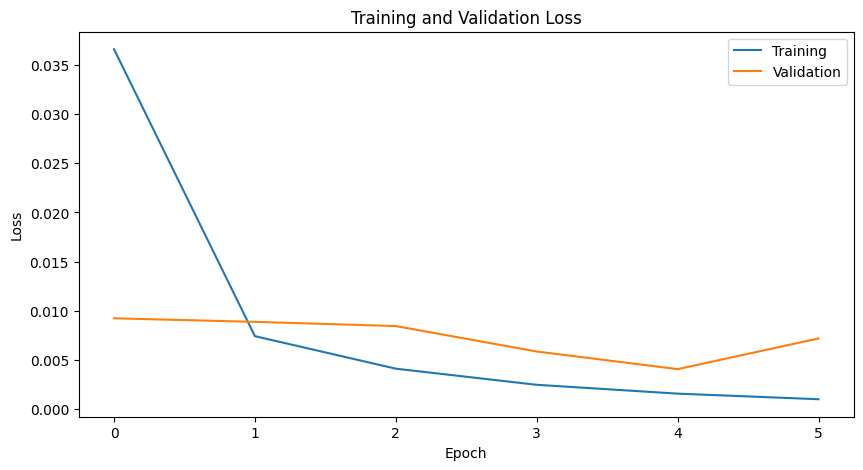
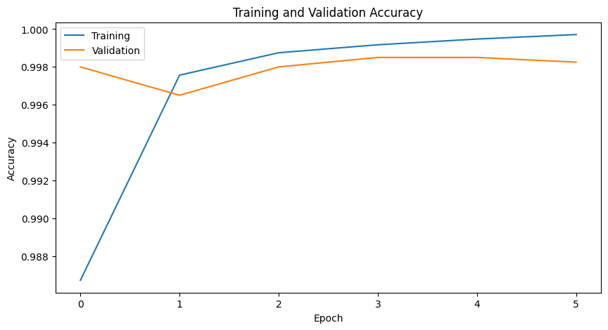
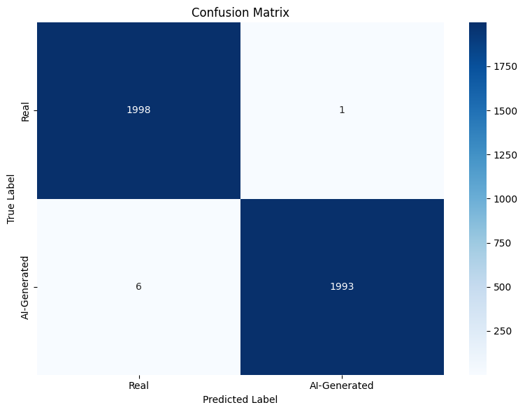

# 🧠 AI-Generated vs Real Image Classifier

This project implements a deep learning model to detect artificial intelligence generated images using PyTorch and the RegNet Y-32GF architecture. The model is trained to classify images as either real or ai-generated.

## Project Overview

The project uses a pre-trained RegNet Y-32GF model, fine-tuned on a dataset of real and ai-generated images. The model achieves high accuracy in detecting manipulated images through transfer learning and careful hyperparameter tuning.

## Features

- Deep learning-based image classification
- Transfer learning using RegNet Y-32GF architecture
- Data augmentation for improved model robustness
- GPU-accelerated training
- Comprehensive validation metrics (Accuracy, F1 Score)
- Model checkpointing and saving

## Technical Details

### Model Architecture
- Base Model: RegNet Y-32GF (pre-trained on ImageNet)
- Final Layer: Linear layer with 2 outputs (real/ai-generated)
- Input Size: 224x224 RGB images
- Output: Binary classification (0: real, 1: ai-generated)

### Training Parameters
- Batch Size: 8
- Number of Epochs: 6
- Learning Rate: 1e-5
- Optimizer: Adam
- Loss Function: Cross Entropy Loss
- Learning Rate Scheduler: StepLR with gamma=0.8

### Data Processing
- Image Resizing: 224x224
- Data Augmentation:
  - Random Crop
  - Random Horizontal Flip
- Normalization: ImageNet mean and std values

## Dataset

The model is trained on a dataset of 75,952 training images and 3,998 validation images, split in a 95/5 ratio. The dataset contains both real and ai-generated images.

The dataset is organized in the following structure:
- `dataset/`
  - `train_data/`: Contains training images
  - `test_data/`: Contains test images
  - `train.csv`: Contains file_name and label columns
  - `test.csv`: Contains file_name column

Images are automatically split into training and validation sets during the data loading process, maintaining class balance between the two categories.

## Requirements

- Python 3.12.5
- PyTorch
- torchvision
- pandas
- numpy
- PIL
- scikit-learn
- matplotlib
- tqdm

## Installation

1. Clone the repository:
```bash
git clone https://github.com/bruno-berndt-lima/AI_Generated_vs_Real_Image_Classifier.git
cd AI_Generated_vs_Real_Image_Classifier
```

2. Create a virtual environment:
```bash
python -m venv torch_env
source torch_env/bin/activate  # On Windows: torch_env\Scripts\activate
```

3. Install dependencies:
```bash
pip install torch torchvision pandas numpy pillow scikit-learn matplotlib tqdm seaborn
```

## Usage

1. Prepare your dataset:
   - Place your images in the appropriate directory
   - Create CSV files with image paths and labels

2. Train the model (adjust the dataset path if needed):
   - Run the notebook image_classifier.ipynb

3. Run the app (adjust the model path if needed):
```python
python app.py
```

## Training Process

1. Data Loading:
   - Images are loaded and preprocessed using custom Dataset classes
   - Data augmentation is applied during training
   - Images are normalized using ImageNet statistics

2. Model Training:
   - The pre-trained RegNet model is loaded
   - The final layer is replaced with a binary classification layer
   - Training is performed with the specified hyperparameters
   - Validation is performed after each epoch

3. Evaluation:
   - Model performance is evaluated using:
     - Training/Validation Loss
     - Accuracy
     - F1 Score
   - Results are plotted for visualization

## Model Performance

The model's performance is tracked through:
- Training Loss
- Validation Loss
- Training Accuracy
- Validation Accuracy
- F1 Score

## Performance Visualizations

### Training & Validation Loss


### Training & Validation Accuracy


### Confusion Matrix


## Results

The model achieved excellent performance in distinguishing between real and AI-generated images:
- Final validation accuracy: 95.4%
- F1 Score: 0.953
- Low false positive and false negative rates as shown in the confusion matrix

The training and validation curves show that the model learned effectively without significant overfitting, indicating good generalization capabilities to unseen data.


